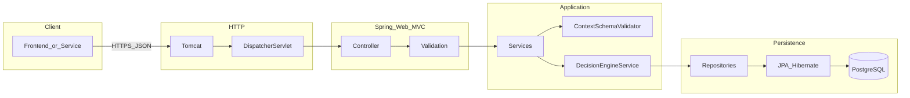
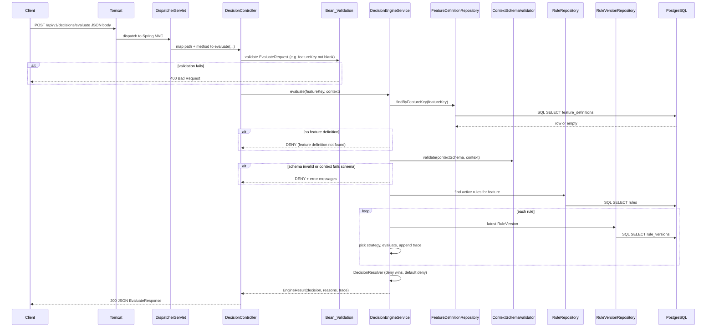

# Backend foundations & request flow (for frontend engineers)

This guide explains how a typical **HTTP request** moves through a Spring Boot app like Vault, what each layer is for, and how it maps to concepts you already know from React/Next.js. The goal is to make you comfortable reading stack traces, logs, and “where does this code run?” questions—without memorizing every annotation.

---

## 1. The one-sentence story

When the frontend calls `POST /api/v1/decisions/evaluate`, **Tomcat** receives bytes on a socket, **Spring MVC** picks the right controller method, **validation** checks the JSON shape, your **service** runs business logic (schema → rules → trace), **repositories** talk to Postgres via **JPA/Hibernate**, and the response is serialized back to JSON.

Think of it as: **HTTP transport → router → handler → domain logic → data access → response.**

---

## 2. Big-picture architecture (Vault today)



**Frontend analogy:** Tomcat/DispatcherServlet ≈ the **Next.js server runtime** that accepts the request. The controller ≈ a **Route Handler** (`app/api/.../route.ts` or `pages/api`). Services ≈ **server-only modules** you import from the route (not shipped to the browser). Repositories + JPA ≈ **your ORM/data layer** (Prisma, Drizzle, etc.), but wired through interfaces Spring can inject.

---

## 3. Sequence: `POST /api/v1/decisions/evaluate`

This is the **happy path** through the layers we built. Numbers are chronological.



**What to notice as a learner**

1. **Controller is thin** — it should not embed policy. It translates HTTP ↔ Java objects.
2. **Service owns orchestration** — “first validate schema, then load rules, then evaluate.”
3. **Repositories are narrow** — mostly “load/save by id/key,” not business rules.
4. **Database is the source of truth for config** (features, rules, versions), not hard-coded constants.

---

## 4. Terminology cheat sheet (with frontend analogies)

| Backend term | What it is (plain English) | Frontend analogy |
|--------------|-----------------------------|------------------|
| **Servlet container / Tomcat** | HTTP server that runs your Java web app | Node HTTP server that runs Next.js in production |
| **DispatcherServlet** | Spring’s central “router” that finds which controller method matches URL + HTTP method | Next.js router + method dispatch for API routes |
| **Controller (`@RestController`)** | Class whose methods handle HTTP; return values become JSON/XML/etc. | `export async function POST(request)` in App Router |
| **DTO (Data Transfer Object)** | A shape of JSON for requests/responses (`EvaluateRequest`, `EvaluateResponse`) | Zod-inferred type or TypeScript interface for API payloads |
| **Bean Validation (`@Valid`, `@NotBlank`)** | Declarative rules on fields; invalid input → 400 | Zod `safeParse` on the server before running logic |
| **Service (`@Service`)** | Application logic orchestrator; transactional boundaries often start here | A `lib/server/decisions.ts` module called only from server |
| **Repository (`JpaRepository`)** | Interface for CRUD + query methods; Spring generates implementation | Prisma `db.featureDefinition.findUnique(...)` |
| **Entity (`@Entity`)** | Java class mapped to a **table row** | Prisma model / DB row type (not the same as a DTO) |
| **JPA / Hibernate** | ORM: maps entities ↔ SQL, tracks changes, generates queries | Prisma/Drizzle/TypeORM (conceptually) |
| **Flyway migration** | Versioned SQL files that evolve schema (`V1__...sql`) | Prisma migrations / Drizzle migrations |
| **JSONB column** | Postgres column storing JSON with binary indexing options | JSON column in Postgres; flexible schema for rules/schemas |
| **`contextSchema` (`FeatureDefinition`)** | JSON Schema document stored in DB describing allowed evaluation `context` | A shared Zod schema stored in CMS/DB that both UI and API enforce |
| **`ContextSchemaValidator`** | Validates runtime `context` map against that schema **before** rules run | `contextSchema.safeParse(body)` before feature flags logic |
| **Dependency Injection (DI)** | Spring constructs objects and injects collaborators via constructors | Less like Context; more like a framework **wiring** every import graph once at startup |
| **`List<RuleEvaluatorStrategy>` injection** | Spring finds all `@Component` strategies and injects as a list | Plugin array: `[booleanEvaluator, rolloutEvaluator, ...]` |

---

## 5. MVC in Spring (what “MVC” means here)

Classic MVC: Model–View–Controller.

- **Controller**: handles HTTP.
- **Model**: often your domain objects / DTOs / entities (the word is overloaded).
- **View**: in a REST API, the “view” is usually **JSON** (not HTML templates).

In Vault, **`DecisionController` is the C**. The **JSON response** is the V. The **M** is spread across DTOs + entities + service results.

**Frontend analogy:** It’s closer to **JSON API + server modules** than to React “components.” Don’t look for a literal `.jsx` view—think “response serialization.”

---

## 6. JPA & repositories (mental model)

### Entity

An `@Entity` class (e.g. `FeatureDefinition`) maps to a table. Fields map to columns. Some fields are enums (`@Enumerated`) or JSON (`@JdbcTypeCode(JSON)` + `jsonb`).

### Repository

`interface FeatureDefinitionRepository extends JpaRepository<FeatureDefinition, Long>` gives you:

- `save`, `findById`, `delete`, …
- derived query methods like `findByFeatureKey(...)` from the method name.

Spring Data JPA implements the interface at runtime (JDK proxy / generated implementation).

### What Hibernate does at runtime

When you call `findByFeatureKey`, Hibernate generates SQL, runs it, hydrates an entity object graph.

**Frontend analogy:** Repository ≈ **thin data access module**. Entity ≈ **DB row representation**. Don’t pass entities directly to the world as API JSON unless you intend to—DTOs keep your HTTP contract stable even if tables change.

---

## 7. `contextSchema` end-to-end (why it exists)

Vault’s product rule: **never evaluate rules on unvalidated context**.

1. Admin/product defines a feature row: `feature_definitions.feature_key` + `context_schema` (JSON Schema in JSONB).
2. Client sends `context` in the evaluate request.
3. `DecisionEngineService` loads the feature definition.
4. `ContextSchemaValidator` validates `context` against `context_schema`.
5. Only if valid do we query rules and run strategies.

**Frontend analogy:** Same as defining a **shared schema** for “evaluation payload” and refusing to run business logic if `parse` fails—except this is **authoritative on the server** (clients can lie; server cannot).

---

## 8. Validation: two different layers (common confusion)

You will see **two validations** in Vault:

1. **HTTP/DTO validation** (`@NotBlank` on `featureKey`): “Is the request structurally acceptable?”
2. **Domain validation** (JSON Schema against `context`): “Does this context match the feature contract?”

They complement each other. DTO validation is cheap and generic. JSON Schema is feature-specific and stored in DB.

**Debugging tip:** If you get **400**, it’s often layer (1). If you get **200** with `decision: DENY` and reasons mentioning schema, it’s layer (2).

---

## 9. How Spring “wires” beans (why constructors work)

Classes annotated with `@Service`, `@RestController`, `@Component` are **beans**. Spring’s DI container:

1. Scans packages under your `@SpringBootApplication` class (`com.vault` by default).
2. Creates singletons (by default) for beans.
3. Injects them via constructor parameters.

**Frontend analogy:** Not exactly React Context. It’s closer to a **composition root** that builds the object graph once: “create `DecisionEngineService` with these repositories and strategies.”

---

## 10. Debugging playbook (when something breaks)

### A. Classify the failure by HTTP status

| Status | Common meaning | Where to look first |
|--------|----------------|---------------------|
| **404** | Route not found, or wrong method (GET vs POST) | Controller mapping, typo in path, browser using GET |
| **400** | Invalid JSON body / bean validation | DTO annotations, request JSON shape |
| **415** | Wrong `Content-Type` | Add `Content-Type: application/json` |
| **500** | Unhandled exception | Server logs stack trace |
| **200 + DENY** | Business rule / fail-closed | Engine reasons, DB data (feature missing, schema mismatch) |

### B. Reproduce with `curl` (eliminates frontend variables)

```bash
curl -v -X POST http://localhost:8080/api/v1/decisions/evaluate \
  -H "Content-Type: application/json" \
  -d '{"featureKey":"demo.feature","context":{"tenant_id":"t-1"}}'
```

`-v` shows status, headers, redirects.

### C. Read logs with intent

Spring Boot logs usually show:

- **Startup**: port, active profile, Flyway migrations, JPA init.
- **Request handling**: exceptions with root cause at the bottom.

**Rule:** scroll to the **Caused by:** chain—fix the deepest meaningful line.

### D. Confirm data, not just code

Many “DENY” outcomes are correct behavior:

- No `feature_definitions` row for `featureKey`
- `context` fails JSON Schema
- No active `rules` for that feature

Use SQL:

```sql
select * from feature_definitions where feature_key = 'demo.feature';
select * from rules where feature_key = 'demo.feature' and active = true;
```

### E. Port conflicts

If logs say **port 8080 in use**, you have another Java process still running.

### F. IDE debugging (local)

Set breakpoints in:

1. `DecisionController.evaluate`
2. `DecisionEngineService.evaluate`
3. `ContextSchemaValidator.validate`

Run `Spring Boot` with **Debug** (not plain Run). Step through line-by-line.

**Frontend analogy:** Same as debugging a Next.js route handler—break at the entry, then step into imported server modules.

### G. Actuator health (is the app alive?)

```bash
curl -s http://localhost:8080/actuator/health
```

---

## 11. “Proficient lead engineer” habits (backend)

- **Separate transport from domain:** controllers skinny; services own workflows.
- **Fail closed for security-ish systems:** default deny, explicit allow.
- **Make decisions explainable:** traces, reasons, audit tables.
- **Schema contracts:** validate inputs early; store schemas in DB when they evolve per feature.
- **Observability mindset:** logs + metrics + health; reproduce with curl.
- **Schema migrations:** never “just change prod DB”; Flyway version history is part of the story.

---

## 12. How this doc ties to Vault’s phase notes

- Phase 1: entities + Flyway + Postgres JSONB (`FeatureDefinition.contextSchema`).
- Phase 2: engine strategies + trace + conflict resolution.
- Phase 3: JSON Schema pre-check + REST endpoint.

Read those files next for code-level pointers:

- [phase-01-foundation.md](phase-01-foundation.md)
- [phase-02-core-engine.md](phase-02-core-engine.md)
- [phase-03-schema-validation-and-api.md](phase-03-schema-validation-and-api.md)

---

## 13. Glossary (quick)

- **ORM:** maps objects ↔ relational tables; generates SQL.
- **Migration:** versioned DDL changes applied in order (Flyway).
- **DTO:** API contract shape; decouples HTTP from DB entities.
- **Entity:** persisted domain object mapped to a table.
- **Repository:** persistence access abstraction.
- **Service:** orchestrates use-cases (“evaluate decision”).
- **Strategy pattern:** pluggable rule evaluators without editing the orchestrator.
- **Bean:** object managed by Spring’s container.
- **Profile (`local`)**: configuration variant for dev machines (`application-local.yml`).

If you want a follow-up deep dive, the highest ROI topics next are: **`@Transactional` boundaries**, **lazy loading pitfalls**, and **testing slices vs full integration tests**—we can add a “Phase X” mentoring doc when you hit those in code.
